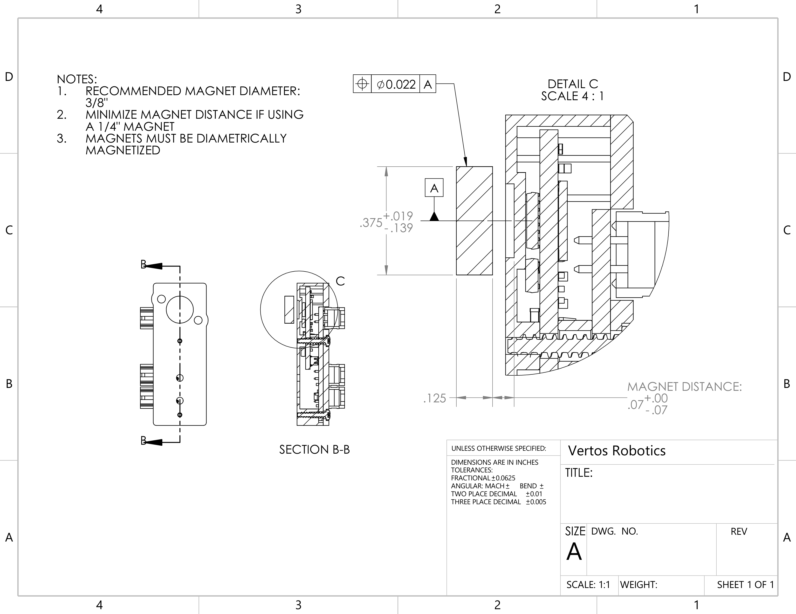

# Magnet Specifications

## Recommended magnets

| Part Number                                    | Description                                                                  |
| ---------------------------------------------- | ---------------------------------------------------------------------------- |
| [5862K204](https://www.mcmaster.com/5862K204/) | 
Neodymium Magnet
 Magnetized Through Diameter, 1/8" Thick, 3/8" OD
 |
| [5862K213](https://www.mcmaster.com/5862K213/) | 
Neodymium Magnet
 Magnetized Through Diameter, 1/4" Thick, 1/4" OD
 |

<figure><figcaption></figcaption></figure>
