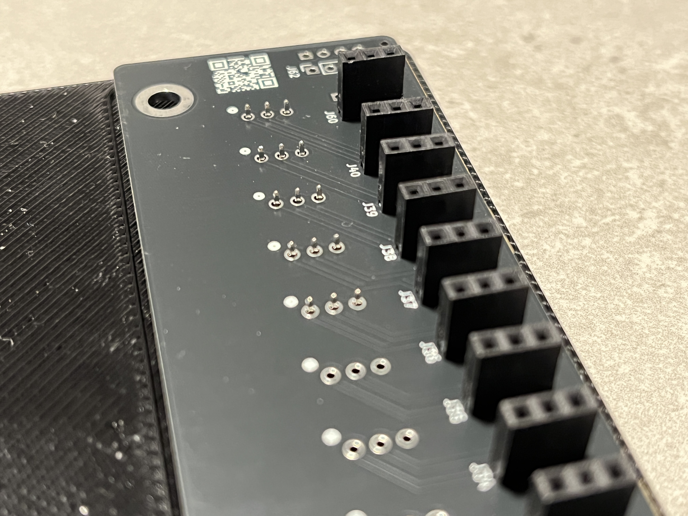
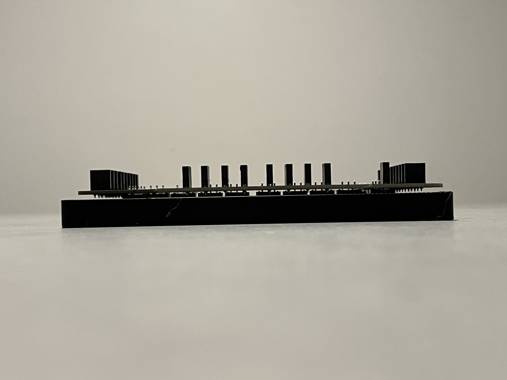
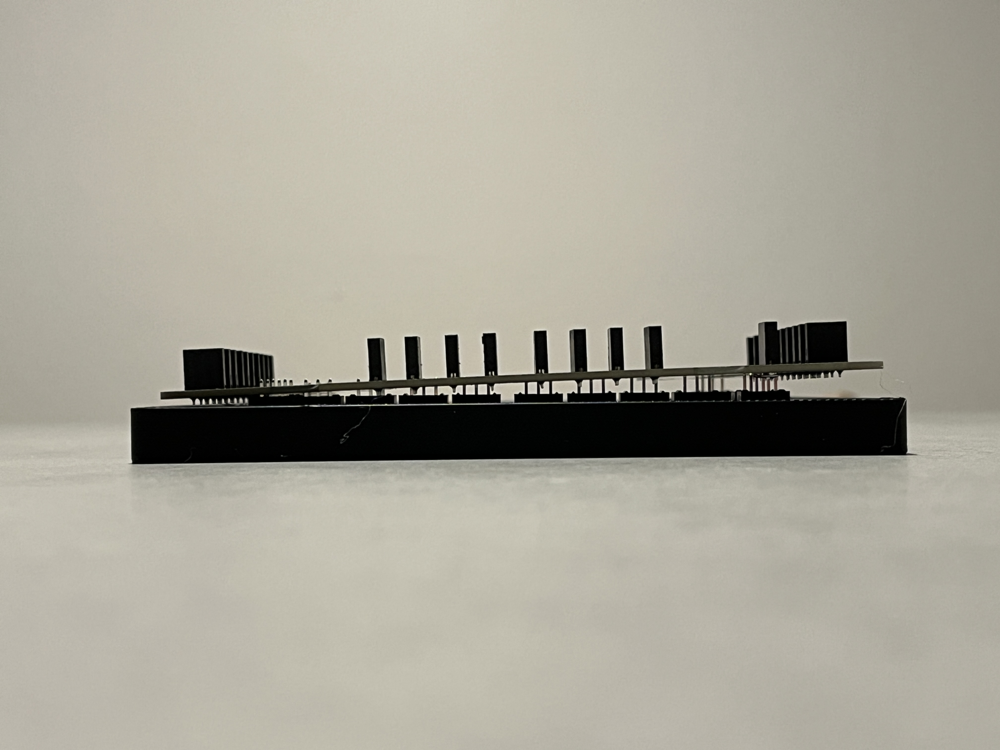

# Assembly

## Required components

* ClickIO Board
* Molex SL Connectors
  * Molex part number 0705430037
  * [Digikey](https://www.digikey.com/en/products/detail/molex/0705430037/313740?s=N4IgTCBcDaIAwHY4FYAsBmOd0JAXQF8g)
* Soldering Jig (optional)

## Printing the soldering jig

[Download](https://cdn.shopify.com/s/files/1/0633/2783/0104/files/Soldering_Jig_V3.zip?v=1738914655) the jig model and import it into your preferred slicing software. The jig is optimized for printing with a nozzle diameter of 0.4–0.6 mm and a layer height of 0.2–0.35 mm. Other print settings and print material have minor impact and can be left up to user preference.

<figure><figcaption></figcaption></figure>

## Preparing to solder

Begin by placing the connectors into the soldering jig.&#x20;


Depending requirements, it may not be necessary to populate all connectors.&#x20;


The jig is designed with keying features to ensure connectors are correctly aligned with the proper polarity during soldering. It also prevents potential misalignment during the soldering process.\

<figure><figcaption></figcaption></figure>

Place the [PCB ](#user-content-fn-1)[^1]onto the connectors with the QR code side facing up. Gently adjust and wiggle the board to align the pins with the connector pads. Confirm a precise fit before moving on to soldering.

<figure><figcaption></figcaption></figure>

Before soldering, ensure that all pins extend through the PCB[^1] by the same distance.

<figure><figcaption>
Typical stick out with 5 connectors about to be installed
</figcaption></figure>

Ensure that there is a small, uniform gap between the jig and the PCB[^1].

<figure><figcaption>
Correct
</figcaption></figure> <figure><figcaption>
Incorrect
</figcaption></figure>

## Solder the connectors

1. One pin on each connector should be soldered to hold the connectors in place.
2. The assembly should be carefully removed from the jig for inspection.
   * Ensure there are no gaps between the connectors and the PCB.
   * Confirm that all connectors are straight and properly aligned.
3. Once alignment has been verified, the remaining pins should be soldered with smooth, even joints. Excess solder should be avoided to prevent bridging.

## Preparing the roboRIO

Before mounting, inspect the roboRIO for bent pins. If any are found, carefully bend them back before installation.

<figure><figcaption></figcaption></figure>

## Installation

Align the board over the roboRIO, gently adjusting it to ensure proper pin alignment. Apply pressure to one corner and gradually press around the board until there is approximately 1/16" of space between the roboRIO and the board.

<figure><figcaption>
Board does not have connectors
</figcaption></figure>

[^1]: Printed Circuit Board
