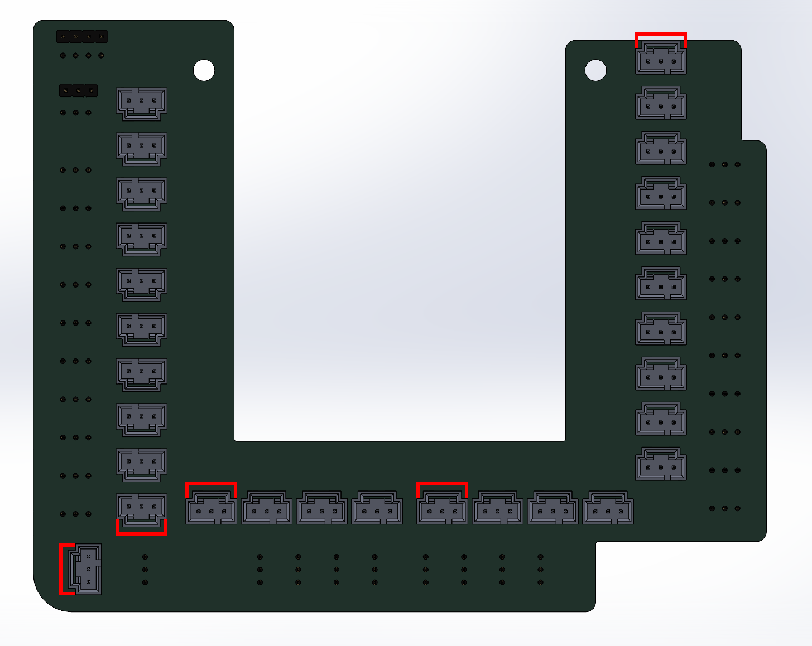

# Connector Orientation

Install the connectors with the latch facing in the direction of the red marker, as shown in the picture, to ensure compatibility with AndyMark premade cables. Note that the PCB silkscreen indicates the PWM, analog, and relay connectors in the opposite orientation. Disregard the silkscreen and follow the orientation shown in the picture for proper installation.

<figure><figcaption></figcaption></figure>

